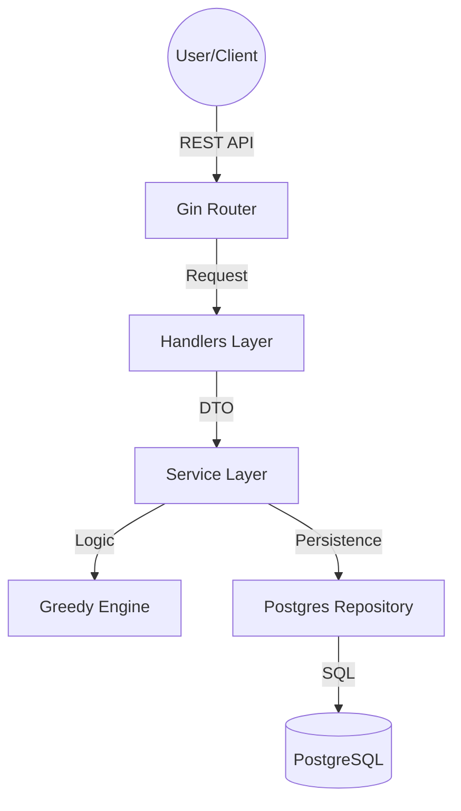

# Debt Optimization & Settlement Engine

## What is this?
This is a straightforward, production-ready Go API for tracking group expenses and settling debts. The main goal is to make sure everyone gets paid back with the fewest number of bank transfers possible. We built this to be exact—using proper decimal math instead of risky floats—and efficient.

### System Architecture

For the best experience, view this diagram on GitHub.

#### Graphical Overview (GitHub Only)


#### Universal Sketch (Works on all platforms)
```text
  ┌───────────────┐      ┌────────────────┐      ┌───────────────┐
  │  Client/User  │ ────▶│  API (Gin ML)  │ ────▶│ Service Layer │
  └───────────────┘      └────────────────┘      └───────┬───────┘
                                                         │
                                         ┌───────────────┴───────────────┐
                                         ▼                               ▼
                                 ┌───────────────┐               ┌───────────────┐
                                 │ Greedy Engine │               │ Postgres Repo │
                                 └───────────────┘               └───────┬───────┘
                                                                         │
                                                                         ▼
                                                                 ┌───────────────┐
                                                                 │ PostgreSQL DB │
                                                                 └───────────────┘
```

### Quick Links
- [How the matching works](ALGORITHM.md)
- [Design choices & Tech stack](DESIGN.md)
- [Example scenarios](EXAMPLES.md)
- [How to test the API](API_TESTING.md)
- [Project development notes (AI Prompts)](prompts.md)

---

## Key Features
- **Smart Debt Matching**: Uses a "greedy" approach to settle group debts in N-1 transactions or less.
- **Accuracy First**: We use `shopspring/decimal` for every calculation. No rounding errors, no missing cents.
- **Flexible Filters**: You can filter balances and settlements by date (using `from` and `to` query params).
- **Strategy Benchmarking**: Check how much better the optimized math is compared to basic pairwise settlement.
- **Clean Code**: Standard Go project structure with clear separation between routing, logic, and database.

---

## API At a Glance

| Method | Endpoint | What it does |
| :--- | :--- | :--- |
| `POST` | `/users` | Create a new user. |
| `POST` | `/groups` | Create an expense group. |
| `POST` | `/groups/:id/members` | Add a user to a group. |
| `POST` | `/groups/:id/expenses` | Add a bill (auto-split supported). |
| `GET` | `/groups/:id/balances` | See who is in the red or black. |
| `GET` | `/groups/:id/settlement` | Get the payment plan. |
| `GET` | `/groups/:id/settlement/compare` | Compare matching strategies. |
| `GET` | `/health` | Check if the API and DB are alive. |

---

## Getting Started

### 1. Setup
- Make sure you have **Go 1.22+** and **PostgreSQL** installed.
- Set up your `.env` file with your database credentials (check `config/config.go` for the keys).

### 2. Run Migrations
Import the schema into your Postgres database:
```bash
psql -d your_db_name -f migrations/001_init_schema.sql
```

### 3. Start the Engine
```bash
go run cmd/main.go
```

### 4. Try it out
Here is how you'd add a ₹120 dinner split between three people:
```bash
curl -X POST http://localhost:8080/groups/<GROUP_ID>/expenses \
-H "Content-Type: application/json" \
-d '{
    "payer_id": "<PAYER_UUID>",
    "amount": "120.00",
    "description": "Team Dinner",
    "split_type": "EQUAL",
    "splits": [
        {"user_id": "<USER_1>"},
        {"user_id": "<USER_2>"},
        {"user_id": "<USER_3>"}
    ]
}'
```

---

## Performance Notes
- **Time Complexity**: O(n log n). The bottleneck is just sorting the people by how much they owe or are owed.
- **Consistency**: We use database transactions to make sure that if a split fails, the whole expense isn't saved.
